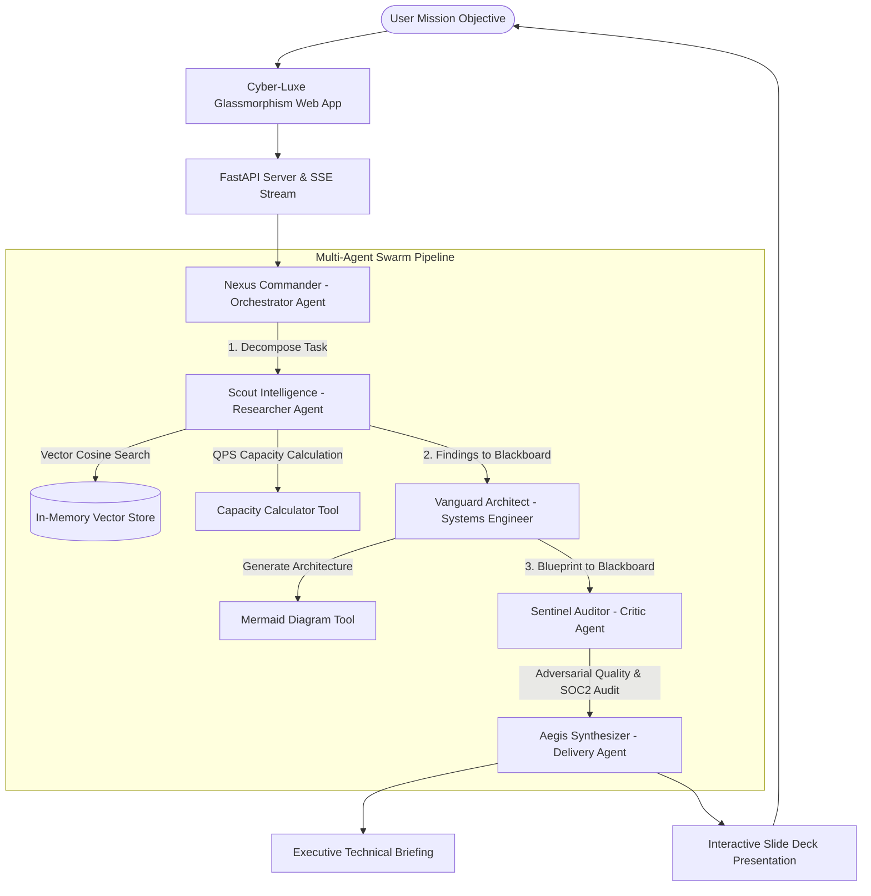

# 🤖 Google ADK Multi-Agent Orchestrator Framework

> An enterprise-grade, modular multi-agent orchestration platform built with **Python**, **Google Agent Development Kit (ADK)** principles, in-memory **Semantic Vector RAG**, deterministic **Tool Calling**, and an **Executive Presentation Slide Generator**.

[](https://python.org)
[](https://fastapi.tiangolo.com)
[](https://cloud.google.com/run)
[](LICENSE)

---

## 🌟 Key Highlights & Architectural Capabilities

1. **Zero-Config Offline Mode (Out-of-the-box)**:
   - Operates **100% without any external API keys or paid accounts**.
   - Features a high-fidelity local contextual reasoning and simulation engine that models Google Gemini multi-turn tool calling and reflection loops.
   - Seamlessly switches to live **Google Gemini 1.5 Pro / Flash** whenever `GEMINI_API_KEY` is provided.

2. **Modular Multi-Agent Swarm (Google ADK Architecture)**:
   - 🧠 **Nexus Commander (Orchestrator)**: Autonomous mission decomposition into an asynchronous Directed Acyclic Graph (DAG) with dependency contracts.
   - 🔍 **Scout Intelligence (Researcher)**: Semantic Vector Store RAG querying cloud best practices, BeyondCorp Zero-Trust standards, and capacity metrics.
   - 🏛️ **Vanguard Architect (Systems Engineer)**: Designs scalable microservice topologies, data models, and generates formatted Mermaid.js diagrams.
   - 🛡️ **Sentinel Auditor (Critic)**: Adversarial security and quality review; audits for cold starts, SPOF, and calculates quantitative quality scores (0–100).
   - 🎯 **Aegis Synthesizer (Executive Delivery)**: Compiles deliverables into stakeholder briefings and generates an **Interactive Presentation Slide Deck**.

3. **In-Memory Semantic Vector Store (RAG)**:
   - Built-in TF-IDF vectorizer and cosine similarity matching engine.
   - Pre-indexed with Google Cloud Well-Architected Framework, BeyondCorp Zero-Trust, and Multi-Agent Design Patterns.
   - Full live query explorer in the UI with instant similarity scoring.

4. **1-Click Turnkey Deployment to Google Cloud Run**:
   - Single script ([`deploy/deploy_to_gcp.sh`](deploy/deploy_to_gcp.sh)) that containerizes the application via Google Cloud Build and deploys an auto-scaling HTTPS service to Google Cloud Run in minutes.

5. **Interactive Executive Presentation Generator**:
   - When a mission concludes, the system autonomously synthesizes a multi-slide presentation deck.
   - Includes fullscreen presenter mode, keyboard controls (`←` / `→` / `Esc`), slide counter, and 1-click standalone HTML download.

---

## 🏗️ System Architecture & Execution DAG



---

## 🚀 Quick Start (Local Development)

### 1. Prerequisites
- Python 3.9 or higher

### 2. Setup Virtual Environment & Run
```bash
# Navigate to project directory
cd agents/myagents

# Create virtual environment
python3 -m venv .venv
source .venv/bin/activate

# Install dependencies
pip install -r requirements.txt

# Start the application server
uvicorn app.main:app --host 127.0.0.1 --port 8080 --reload
```

Open your browser at **`http://localhost:8080`**.
* Interactive Web UI: `http://localhost:8080`
* Swagger / OpenAPI Docs: `http://localhost:8080/docs`

---

## ☁️ 1-Click Deployment to Google Cloud Run

To deploy the entire multi-agent application directly to production on **Google Cloud Platform**:

```bash
cd agents/myagents
./deploy/deploy_to_gcp.sh
```

### What the Script Automates:
1. Validates `gcloud` CLI authentication and project configuration.
2. Enables Google Cloud Run (`run.googleapis.com`) and Cloud Build (`cloudbuild.googleapis.com`).
3. Submits multi-stage container build to Google Cloud Build.
4. Deploys container to Google Cloud Run with:
   - Auto-scaling (0 to 20 instances)
   - 512 MB memory / 1 vCPU
   - Public unauthenticated HTTPS endpoint
   - Production environment variables

---

## 🧪 Running Automated Tests

Run the test suite covering the vector store, tool registry, and multi-agent integration:

```bash
cd agents/myagents
python3 -m unittest discover -s tests -p "test_*.py"
```

---

## 📂 Project Directory Structure

```text
agents/myagents/
├── app/                                # FastAPI Web Application & UI
│   ├── main.py                         # REST & SSE Streaming Server
│   ├── static/
│   │   ├── css/styles.css              # Cyber-Luxe Glassmorphism Design System
│   │   └── js/
│   │       ├── app.js                  # Frontend Application Controller
│   │       ├── graph.js                # Interactive Multi-Agent DAG Visualizer
│   │       └── presentation.js         # Slide Deck Presentation Engine
│   └── templates/
│       └── index.html                  # Single Page Application
│
├── core/                               # Multi-Agent Framework Core
│   ├── orchestrator.py                 # Mission Planner & DAG Scheduler
│   ├── base_agent.py                   # Agent Abstraction with Memory & Tools
│   ├── memory.py                       # Blackboard Shared Memory & Traces
│   ├── vector_store.py                 # In-Memory Cosine Similarity Vector Store
│   ├── llm_adapter.py                  # Dual Engine (Local Simulator & Gemini Live)
│   └── tools.py                        # Autonomous Tool Registry
│
├── agents_pool/                        # Specialized Domain Agents
│   ├── orchestrator_agent.py           # Nexus Commander
│   ├── researcher_agent.py             # Scout Intelligence
│   ├── architect_agent.py              # Vanguard Architect
│   ├── critic_agent.py                 # Sentinel Auditor
│   └── synthesizer_agent.py            # Aegis Synthesizer
│
├── knowledge_base/                     # Built-in Vector Corpus
│   ├── gcp_best_practices.json         # Google Cloud Architecture Standards
│   ├── multi_agent_patterns.json       # Google ADK Design Patterns
│   └── security_compliance.json        # BeyondCorp Zero-Trust Standards
│
├── deploy/                             # GCP Production Deployment
│   ├── Dockerfile                      # Multi-Stage Production Container Build
│   ├── docker-compose.yml              # Local Docker Compose File
│   └── deploy_to_gcp.sh                # 1-Click GCP Cloud Run Script
│
├── tests/                              # Automated Test Suite
│   ├── test_vector_store.py
│   ├── test_tools.py
│   └── test_orchestrator.py
│
├── requirements.txt                    # Python Dependencies
├── .env.example                        # Configuration Template
└── README.md                           # Documentation & Architecture
```

---

## 👤 Author

**Abhijeet Raut**
- GitHub: [@arauthub](https://github.com/arauthub)
- Email: theabhijeetraut@gmail.com
- Monorepo: [arauthub/All-Projects](https://github.com/arauthub/All-Projects)

---

## 📄 License

This project is licensed under the [MIT License](../../LICENSE).
