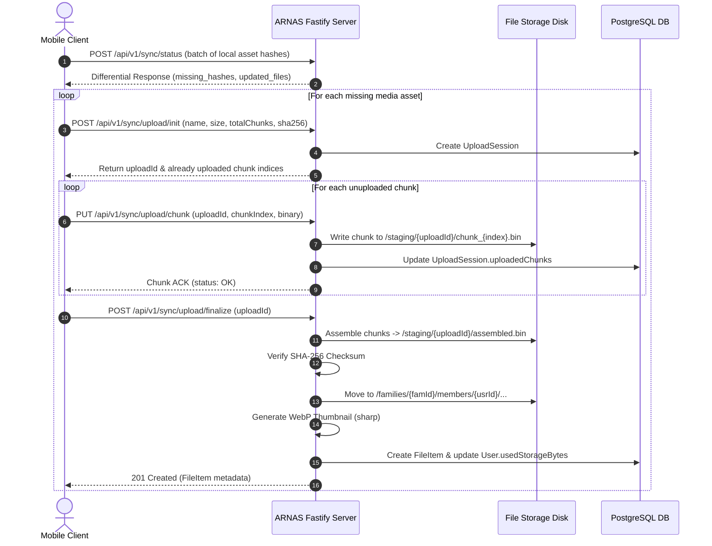

# ARNAS Execution Specification (ARNAS-SPEC-001)

| Parameter | Specification |
| :--- | :--- |
| **Project Name** | ARNAS (Autonomous & Private Family Cloud Drive) |
| **Target Platforms** | Server (Linux / macOS Docker), Mobile Client (iOS & Android via Expo) |
| **Primary Authors** | Antigravity AI & Engineering Lead |
| **Status** | Approved for Execution |
| **Version** | 1.0.0 |

---

## 1. System Objectives & Scope

1. **Family Multi-Tenancy**: Support independent accounts for each family member with private home directories, storage quotas, and shared "Family Vault" folders.
2. **Robust Mobile Synchronization**: Automatic background synchronization of mobile photos, videos, and documents without draining battery or missing media.
3. **Resilient Chunked Uploads**: Mobile network connections drop frequently; uploads must chunk data (2MB-5MB), calculate SHA-256 checksums per chunk, and resume from the exact last uploaded chunk.
4. **Data Ownership & Zero Vendor Lock-in**: Raw files are preserved on the host filesystem with a standard, predictable directory structure, even if the database is rebuilt.
5. **Private Remote Access**: Zero port-forwarding requirements through native Tailscale or Cloudflare Tunnel configurations.

---

## 2. Technical Stack

| Tier | Technology | Rationale |
| :--- | :--- | :--- |
| **Backend Framework** | Node.js + Fastify (TypeScript) | High throughput, low memory footprint, first-class streaming support |
| **Database & ORM** | PostgreSQL 16 + Prisma ORM | ACID transactional integrity for file trees, relational family ACLs |
| **File Processing** | `sharp` (images), `fluent-ffmpeg` (video) | Fast metadata extraction and thumbnail generation |
| **Mobile Client** | React Native (Expo SDK 51+) + TypeScript | Cross-platform, native media library hooks, background fetch APIs |
| **Local Mobile Cache** | `expo-sqlite` (or WatermelonDB) + `zustand` | Offline-first sync tracking and cached directory navigation |
| **Sync Protocol** | Custom SHA-256 Resumable Chunking | Precise integrity checks, byte-range validation, resume capability |
| **Networking & Reverse Proxy**| Caddy 2 (or Nginx) + Tailscale | Automated HTTPS, WebSocket reverse proxying, private mesh routing |

---

## 3. Data & Storage Model

### 3.1 Host Directory Structure
All user data resides in `/data/storage` mounted from the host:

```
/data/storage/
├── families/
│   └── {family_id}/
│       ├── shared/                  <-- Family Vault (accessible to all members)
│       │   ├── Photos/
│       │   └── Documents/
│       └── members/
│           └── {user_id}/           <-- Member Private Space
│               ├── camera_roll/
│               │   └── {YYYY}/
│               │       └── {MM}/
│               │           └── {sha256_hash}.{ext}
│               └── files/
│                   └── {relative_path}
├── thumbnails/
│   └── {sha256_prefix_2}/
│       └── {sha256_hash}_thumb.webp
└── staging/                         <-- Resumable upload chunks in progress
    └── {upload_session_id}/
        ├── chunk_00000.bin
        ├── chunk_00001.bin
        └── metadata.json
```

### 3.2 Database Schema (Prisma)

```prisma
datasource db {
  provider = "postgresql"
  url      = env("DATABASE_URL")
}

generator client {
  provider = "prisma-client-js"
}

enum Role {
  ADMIN
  MEMBER
  GUEST
}

enum SyncStatus {
  PENDING
  UPLOADING
  COMPLETED
  FAILED
}

model Family {
  id          String     @id @default(uuid())
  name        String
  createdAt   DateTime   @default(now())
  updatedAt   DateTime   @updatedAt
  members     User[]
  files       FileItem[]
}

model User {
  id               String       @id @default(uuid())
  familyId         String
  family           Family       @relation(fields: [familyId], references: [id], onDelete: Cascade)
  email            String       @unique
  name             String
  passwordHash     String
  role             Role         @default(MEMBER)
  storageQuotaBytes BigInt      @default(107374182400) // 100 GB default
  usedStorageBytes BigInt       @default(0)
  createdAt        DateTime     @default(now())
  updatedAt        DateTime     @updatedAt
  files            FileItem[]
  devices          Device[]
  uploadSessions   UploadSession[]
}

model Device {
  id              String       @id @default(uuid())
  userId          String
  user            User         @relation(fields: [userId], references: [id], onDelete: Cascade)
  deviceName      String
  platform        String       // 'ios' | 'android' | 'web'
  pushToken       String?
  lastSeenAt      DateTime     @default(now())
  createdAt       DateTime     @default(now())
  uploadSessions  UploadSession[]
}

model FileItem {
  id               String       @id @default(uuid())
  familyId         String
  family           Family       @relation(fields: [familyId], references: [id], onDelete: Cascade)
  userId           String
  user             User         @relation(fields: [userId], references: [id], onDelete: Cascade)
  parentFolderId   String?
  parentFolder     FileItem?    @relation("FolderHierarchy", fields: [parentFolderId], references: [id])
  children         FileItem[]   @relation("FolderHierarchy")
  name             String
  isDirectory      Boolean      @default(false)
  mimeType         String?
  sizeBytes        BigInt       @default(0)
  checksumSha256   String?      @db.VarChar(64)
  storagePath      String?      // Relative path on disk
  thumbnailPath    String?
  isSharedVault    Boolean      @default(false)
  isFavorite       Boolean      @default(false)
  isDeleted        Boolean      @default(false)
  takenAt          DateTime?    // Media EXIF date
  createdAt        DateTime     @default(now())
  updatedAt        DateTime     @updatedAt

  @@index([userId, parentFolderId])
  @@index([checksumSha256])
  @@index([familyId, isSharedVault])
}

model UploadSession {
  id               String       @id @default(uuid())
  userId           String
  user             User         @relation(fields: [userId], references: [id], onDelete: Cascade)
  deviceId         String?
  device           Device?      @relation(fields: [deviceId], references: [id])
  filename         String
  mimeType         String
  totalSizeBytes   BigInt
  chunkSizeBytes   Int          @default(2097152) // 2MB
  totalChunks      Int
  uploadedChunks   Int[]
  expectedSha256   String       @db.VarChar(64)
  status           SyncStatus   @default(UPLOADING)
  expiresAt        DateTime
  createdAt        DateTime     @default(now())
  updatedAt        DateTime     @updatedAt
}
```

---

## 4. Sync & Upload Protocol Workflow



---

## 5. Mobile App Architecture & Background Sync

### 5.1 Client Components
- **Media Ingestion Worker**: Interacts with `expo-media-library` to query newly shot photos/videos (`createTime > lastSyncedTime`).
- **Sync Journal (SQLite)**:
  - Table: `local_assets` (`id`, `local_uri`, `sha256`, `size`, `sync_status`, `retry_count`, `last_error`).
- **Network & Power Sentinel**:
  - `NetInfo`: Check if unmetered Wi-Fi connection is active.
  - `Battery`: Ensure device is above 20% or plugged into charger.
- **Upload Queue Pipeline**:
  - Max concurrent uploads: `2` (to prevent mobile CPU/battery spikes).
  - Exponential backoff retry: `[2s, 8s, 30s, 120s]`.

### 5.2 Background Task Execution
- On iOS: `expo-background-fetch` + Background Processing Tasks.
- On Android: Native WorkManager via Expo Task Manager (`TaskManager.defineTask`).

---

## 6. Execution Milestones & Phased Plan

```
[Phase 1: Foundation]
  ├── Setup Docker Compose (PostgreSQL, Volume mounts)
  ├── Initialize Fastify TypeScript Server
  └── Run Prisma Migrations & Seed Admin Family

[Phase 2: Core Storage & Auth]
  ├── JWT Auth & Role Guard
  ├── Disk Storage Driver & Chunk Staging Manager
  └── Metadata & Thumbnail Worker (Sharp)

[Phase 3: Resumable Sync API]
  ├── Resumable Upload Endpoints (Init, Chunk, Finalize)
  ├── Differential Check Endpoint
  └── Automated Integration Tests for Multi-Part Uploads

[Phase 4: Mobile App Foundation]
  ├── Expo SDK Setup with TypeScript & Navigation
  ├── Secure Storage for Auth & Server URL
  └── Dark Mode UI Design System

[Phase 5: Media Browser & Manual Operations]
  ├── Family Vault & Personal Folders UI
  ├── Media Preview (Photo Zoom, Video Stream)
  └── Offline Cache & Thumbnail Loading

[Phase 6: Automated Sync Engine]
  ├── Camera Roll Scanner
  ├── SQLite Sync State Machine
  └── Background Upload Worker (Wi-Fi & Power rules)

[Phase 7: Remote Access & Hardening]
  ├── Tailscale / Cloudflare Tunnel Integration Guide
  ├── Caddy Reverse Proxy with Auto HTTPS
  └── Production Readiness Audit
```

---

## 7. Acceptance Criteria

1. **Upload Resume**: Disconnecting the network midway through a 500MB video upload and reconnecting must resume from the last completed chunk without restarting.
2. **Data Integrity**: Every uploaded file must pass a full SHA-256 checksum match before being committed to permanent disk storage.
3. **Multi-Tenancy Isolation**: Member A must never be able to access Member B's private files; only files in `/shared` are visible across the family.
4. **Mobile Battery Efficiency**: Camera roll sync must pause when battery is critical (<20%) or user is on cellular data (if toggle enabled).
5. **No Data Loss on Database Wipe**: Raw files in `/data/storage` must have readable filenames and folder structures permitting recovery with a simple filesystem crawl script.
