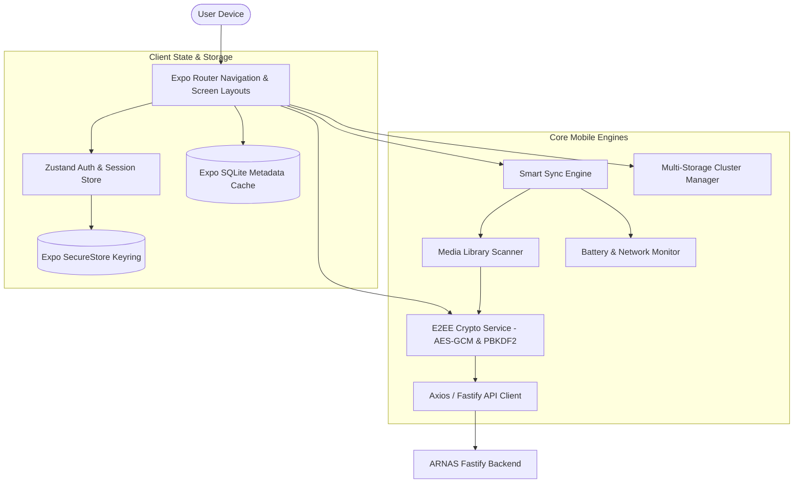

# 📱 ARNAS Mobile — Private Cloud Sync & Vault Client

> Cross-platform mobile client for **ARNAS Private Cloud**, built with **React Native (0.86)**, **Expo SDK (57)**, **Expo Router**, **Zustand**, and client-side **AES-GCM-256 Zero-Knowledge End-to-End Encryption (E2EE)**.

[](https://reactnative.dev)
[](https://expo.dev)
[](https://www.typescriptlang.org)
[](https://csrc.nist.gov)
[](../../../LICENSE)

---

## 🌟 Key Features

1. **Client-Side Zero-Knowledge Encryption (E2EE)**:
   - Hardware-accelerated cryptographic primitives using `expo-crypto` and `expo-secure-store`.
   - PBKDF2 key derivation (100,000 iterations) with cryptographic salt generation.
   - Files are encrypted in AES-GCM-256 chunks prior to leaving the device — the server only receives ciphertext.
2. **Multi-Storage Server Configuration**:
   - Manage storage clusters directly from the mobile UI (`StorageClusterModal.tsx`).
   - Configure multiple storage targets: Primary on-premise NAS, secondary MinIO server, and cloud backup buckets (AWS S3, Wasabi).
   - Real-time node latency pinging, replica status indicators, and health monitoring.
3. **Smart Camera Roll Background Sync**:
   - Automated delta sync queries local camera roll (`expo-media-library`).
   - Power & bandwidth aware: Sync engine monitors battery percentage (`expo-battery`) and network type (`expo-network`), pausing on low battery or cellular metering if configured.
4. **Interactive User Onboarding Tutorial**:
   - Comprehensive 5-stage animated onboarding tutorial (`UserTutorialModal.tsx`) walking through pairing, E2EE key setup, multi-cluster management, and camera roll sync.
   - One-tap manual re-launch from the settings header at any time.
5. **Offline-First SQLite Cache**:
   - High-performance local catalog powered by `expo-sqlite`.
   - Browse cached folders, metadata, and media thumbnails without network connectivity.
6. **SOC2 / GDPR Audit Trail Viewer**:
   - Inspect security audit records (`AuditTrailModal.tsx`) showing timestamped uploads, key exchanges, and multi-server replications.

---

## 🏗️ Mobile Architecture



---

## 🚀 Quick Start (Local Development)

### 1. Prerequisites
- Node.js 20+
- Expo CLI: `npm install -g expo-cli`
- iOS Simulator (macOS with Xcode) or Android Emulator (Android Studio), or Expo Go on physical device.

### 2. Installation
```bash
# Navigate to mobile directory
cd apps/arnas/mobile

# Install dependencies
npm install
```

### 3. Launch the Application
```bash
# Start Expo development bundler
npm run start
```

### 4. Running on Targets
- **iOS Simulator**: Press <kbd>i</kbd> in the Expo terminal prompt (or run `npm run ios`).
- **Android Emulator**: Press <kbd>a</kbd> in the Expo terminal prompt (or run `npm run android`).
- **Web Browser**: Press <kbd>w</kbd> in the Expo terminal prompt (or run `npm run web`).
- **Physical Device**: Scan the generated QR code using the **Expo Go** application.

---

## 🧪 Type Checking

```bash
npm run typecheck
```

---

## 📁 Project Structure

```text
apps/arnas/mobile/
├── app/                        # Expo Router screen tree
│   ├── (tabs)/                 # Tab navigator (Drive, Photos, Sharing, Settings)
│   ├── _layout.tsx             # Root layout and context providers
│   ├── auth.tsx                # Biometric & passphrase login screen
│   └── pair.tsx                # QR-code camera scanner for server pairing
├── src/
│   ├── api/                    # HTTP client with JWT interceptors
│   ├── components/             # Reusable UI components
│   │   ├── UserTutorialModal.tsx     # 5-step interactive onboarding modal
│   │   ├── E2EESecurityModal.tsx     # Zero-knowledge key & envelope manager
│   │   ├── StorageClusterModal.tsx   # Multi-storage server configuration
│   │   ├── AuditTrailModal.tsx       # SOC2 / GDPR compliance log viewer
│   │   ├── StorageMeter.tsx          # Real-time quota breakdown
│   │   └── MediaModal.tsx            # Fullscreen photo & video viewer
│   ├── crypto/
│   │   └── e2ee.service.ts     # Client-side AES-GCM / PBKDF2 / SHA-256
│   ├── services/
│   │   ├── sync-engine.service.ts    # Background synchronization scheduler
│   │   ├── media-scanner.service.ts  # Device asset indexer
│   │   ├── storage-cluster.service.ts# Multi-server health & replication client
│   │   ├── sqlite.service.ts         # Local SQLite cache provider
│   │   └── audit.service.ts          # Security log events
│   ├── stores/
│   │   └── authStore.ts        # Zustand session, server URLs, and auth state
│   └── theme/
│       ├── colors.ts           # Curated dark slate & cyber cyan palette
│       └── index.ts            # Design system tokens
├── app.json                    # Expo configuration
├── babel.config.js             # Babel compiler setup
├── package.json
└── tsconfig.json
```

---

## 👤 Author

**Abhijeet Raut**
- GitHub: [@arauthub](https://github.com/arauthub)
- Email: theabhijeetraut@gmail.com
- Monorepo: [arauthub/All-Projects](https://github.com/arauthub/All-Projects)

---

## 📄 License

This project is licensed under the [MIT License](../../../LICENSE).
