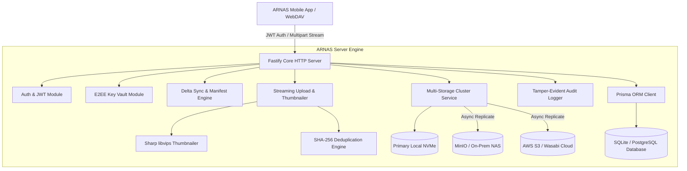

# 🚀 ARNAS Server — Private Cloud Drive & Mobile Sync Backend

> High-throughput, private cloud Network-Attached Storage (NAS) backend built with **Fastify**, **TypeScript**, **Prisma ORM**, **Multi-Storage Node Replication** (Local, AWS S3, MinIO, Wasabi), and client-side **Zero-Knowledge End-to-End Encryption (E2EE)** envelope key management.

[](https://fastify.tiangolo.com)
[](https://www.typescriptlang.org)
[](https://www.prisma.io)
[](https://aws.amazon.com/s3)
[](../../../LICENSE)

---

## 🌟 Architectural Capabilities

1. **Multi-Storage Server Clustering**:
   - Primary storage on high-speed NVMe/local disk with automated async replication to S3-compatible endpoints (AWS S3, MinIO, Wasabi, Ceph).
   - Storage Node failover detection, health check polling, and node latency monitoring.
2. **Zero-Knowledge E2EE Key Vault**:
   - Zero-knowledge key envelope management: Server stores user public keys and encrypted key envelopes (`salt`, `iv`, `wrappedKey`) without ever possessing plaintext decryption keys.
   - Per-file authentication verification via HMAC-SHA256 tokens.
3. **High-Speed Streaming I/O**:
   - `@fastify/multipart` streaming upload pipelines bypass Node.js buffer memory overhead.
   - Instant thumbnail generation for RAW, JPEG, and PNG images via libvips (`sharp`).
4. **Smart Sync & Deduplication**:
   - SHA-256 content-addressable deduplication: identical files across family members or devices are referenced without redundant storage consumption.
   - Sync manifest endpoint calculates delta sets for mobile clients based on vector clocks and revision tags.
5. **Tamper-Evident Audit Logging**:
   - Immutable audit trail recording user logins, file uploads, key rotations, node syncs, and download requests.
6. **OpenAPI / Swagger 3.0 Documentation**:
   - Built-in interactive API explorer available at `/documentation`.

---

## 🏗️ System Architecture



---

## 🚀 Quick Start (Local Development)

### 1. Prerequisites
- Node.js 20+ or 22+
- npm or pnpm

### 2. Installation & Setup
```bash
# Navigate to server directory
cd apps/arnas/server

# Install dependencies
npm install

# Generate Prisma Client & Run Database Migrations
npm run prisma:generate
npm run prisma:migrate

# Seed Database with default test accounts
npm run prisma:seed
```

### 3. Launch Development Server
```bash
npm run dev
```

The server will boot on **`http://localhost:3000`** (or configured `PORT` in `.env`).
- Swagger API Docs: `http://localhost:3000/documentation`
- Healthcheck Endpoint: `http://localhost:3000/health`

---

## 🧪 Testing Suite

Run the unit and integration test suite using Vitest:

```bash
npm test
```

---

## 📂 Directory Structure

```text
apps/arnas/server/
├── prisma/
│   ├── schema.prisma           # Relational schema (Users, Files, StorageNodes, Keys, AuditLogs)
│   ├── migrations/             # SQL schema migration versions
│   └── seed.ts                 # Database seeder script
├── src/
│   ├── config/                 # Environment variables and system constants
│   ├── modules/
│   │   ├── audit/              # SOC2/GDPR compliance audit trails
│   │   ├── auth/               # Bcrypt password hashing & JWT generation
│   │   ├── e2ee/               # Client key envelopes & cryptographic proofs
│   │   ├── family/             # Family members, vaults & permission boundaries
│   │   ├── files/              # Streaming uploads, downloads, mime detection, thumbnails
│   │   ├── storage/            # Multi-storage node cluster manager & S3 replication
│   │   └── sync/               # Mobile delta sync manifest & vector clock engine
│   ├── plugins/                # Fastify plugins (CORS, JWT, Multipart, Swagger)
│   ├── scripts/
│   │   └── pair.ts             # CLI QR-code pairing utility for mobile devices
│   └── server.ts               # Fastify server bootstrap & lifecycle hooks
├── uploads/                    # Local storage primary directory (Git-ignored)
├── package.json
└── tsconfig.json
```

---

## 👤 Author

**Abhijeet Raut**
- GitHub: [@arauthub](https://github.com/arauthub)
- Email: theabhijeetraut@gmail.com
- Monorepo: [arauthub/All-Projects](https://github.com/arauthub/All-Projects)

---

## 📄 License

This project is licensed under the [MIT License](../../../LICENSE).
