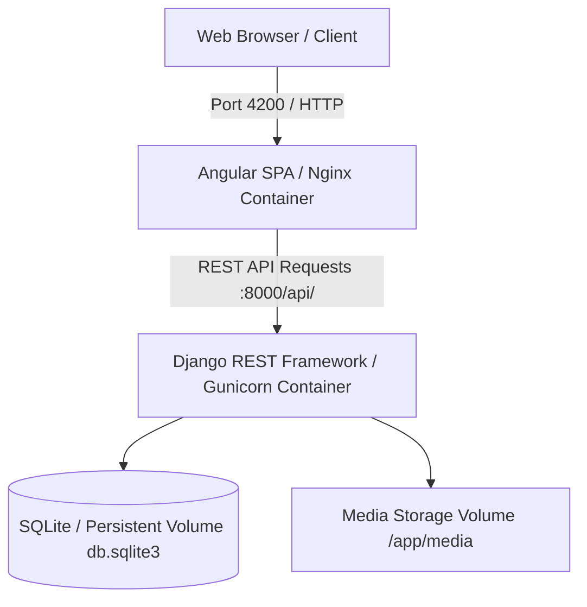

# ⚡ Flashapps: Fullstack Django REST & Angular Platform

> A decoupled fullstack web application featuring a high-performance **Django REST Framework (DRF)** backend API paired with a reactive **Angular Single-Page Application (SPA)** frontend, containerized with multi-stage Docker builds.

[](https://djangoproject.com)
[](https://angular.io)
[](https://docker.com)
[](../../LICENSE)

---

## 🏗️ Architecture & Component Topology



### Core Architecture Highlights:
1. **Decoupled API Architecture**: Clean separation of concerns between backend REST endpoints and frontend presentation layer.
2. **Containerized Multi-Stage Builds**: Independent Docker images for backend (Python 3.9) and frontend (Node build stage + Nginx Alpine runtime).
3. **Data Persistence**: Volume-mounted SQLite database allowing local state retention across container lifecycles.
4. **Reactive Frontend**: Built with Angular components, TypeScript, RxJS observables, and structured HTTP interceptors.

---

## 📂 Project Directory Structure

```text
apps/flashapps/
├── backend/                            # Django REST Framework Backend
│   ├── flashapps_backend/              # Django App Modules & Settings
│   │   ├── settings/                   # Base, Dev, and Prod Settings
│   │   ├── urls.py                     # API Route Definitions
│   │   └── wsgi.py                     # WSGI Application Entrypoint
│   ├── db.sqlite3                      # Database (Docker Volume Mounted)
│   ├── Dockerfile                      # Backend Container Definition
│   └── requirements.txt                # Python Dependencies
│
├── frontend/                           # Angular Single-Page Application
│   ├── src/                            # Angular Source (Components, Services)
│   ├── Dockerfile                      # Multi-Stage Build (Node + Nginx)
│   ├── package.json                    # Frontend Dependencies
│   └── nginx.conf                      # Nginx Reverse Proxy Config
│
├── home/                               # Landing Page & Static Views
├── search/                             # Search Query Routing
└── Dockerfile                          # Root Application Container
```

---

## 🚀 Quick Start (Running via Docker Compose)

The easiest way to run Flashapps with both backend and frontend connected is via the unified Docker Compose configuration:

```bash
# Navigate to Docker orchestration folder
cd devops/docker

# Build and start both backend and frontend containers
docker compose up --build -d
```

### Access Endpoints:
* **Frontend Web Application**: [http://localhost:4200](http://localhost:4200)
* **Backend Django REST API**: [http://localhost:8000](http://localhost:8000)
* **Django Admin Panel**: [http://localhost:8000/admin/](http://localhost:8000/admin/)

---

## 🛠️ Local Development (Without Docker)

### 1. Run Backend:
```bash
cd apps/flashapps/backend
python3 -m venv venv
source venv/bin/activate
pip install -r requirements.txt
python manage.py migrate
python manage.py runserver 0.0.0.0:8000
```

### 2. Run Frontend:
```bash
cd apps/flashapps/frontend
npm install
npm start
```
Frontend runs at `http://localhost:4200` with live reload.

---

## 👤 Author & Monorepo
* **Engineer**: Abhijeet Raut ([@arauthub](https://github.com/arauthub))
* **Repository**: [`All-Projects/apps/flashapps`](https://github.com/arauthub/All-Projects/tree/main/apps/flashapps)
