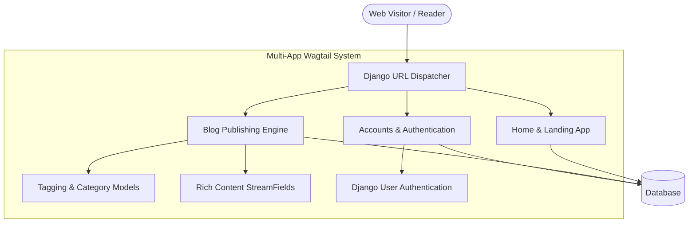

# 📰 Mytail: Wagtail CMS Multi-App Blog & Account Architecture

> A multi-application enterprise CMS platform built with **Python**, **Django**, and **Wagtail CMS**, featuring dedicated modules for user authentication (`accounts`), editorial publishing (`blog`), custom SCSS asset compilation, and Tailwind styling.

[](https://python.org)
[](https://djangoproject.com)
[](https://wagtail.org)
[](https://tailwindcss.com)
[](https://docker.com)
[](../../LICENSE)

---

## 🌟 Key Architectural Features

1. **Multi-App Modular Separation**:
   - **`blog` App**: Rich blog post models with tag indexing, category filtering, author profiles, and responsive article streamfields.
   - **`accounts` App**: Custom authentication views, profile dashboards, password management, and permission tiers.
2. **Hybrid Asset Pipeline**:
   - Automated SCSS compilation pipeline (`compile_scss.py`) converting nested stylesheets into optimized CSS.
   - Tailwind utility integration for rapid layout styling.
3. **Structured Editorial Taxonomy**:
   - Tagging and categories enabled via `modelcluster` and `taggit`.
   - Rich text blocks with custom embeds, image galleries, and code snippets.
4. **Production Dockerization**:
   - Containerized build with volume mounts for media uploads and SQLite database persistence.

---

## 🏗️ Application Topology



---

## 📂 Project Directory Structure

```text
apps/mytail/
└── demo/
    ├── accounts/                       # User Auth, Profiles, & Access Control
    ├── blog/                           # Wagtail Blog Post Models & Feeds
    ├── home/                           # Landing Pages & Navigation
    ├── search/                         # Wagtail Search Engine Routing
    ├── mysite/                         # Settings & Core Configuration
    ├── templates/                      # Modular Django/Wagtail Templates
    ├── static/                         # Static Assets (Images, Icons)
    ├── compile_scss.py                 # Dynamic SCSS Compilation Utility
    ├── tailwind.config.js              # Tailwind Utility Config
    ├── Dockerfile                      # Production Docker Build
    ├── manage.py                       # Django CLI Utility
    └── requirements.txt                # Python Dependencies
```

---

## 🚀 Quick Start (Local Setup)

```bash
cd apps/mytail/demo

# Create and activate virtual environment
python3 -m venv venv
source venv/bin/activate

# Install dependencies
pip install -r requirements.txt

# Run migrations
python manage.py migrate

# Compile SCSS assets
python compile_scss.py

# Create Wagtail admin account
python manage.py createsuperuser

# Start development server
python manage.py runserver 0.0.0.0:8000
```

* **Web Application**: [http://localhost:8000](http://localhost:8000)
* **Wagtail CMS Admin**: [http://localhost:8000/admin/](http://localhost:8000/admin/)

---

## 🐳 Docker Deployment

```bash
cd apps/mytail/demo
docker build -t mytail:latest .
docker run -p 8000:8000 mytail:latest
```

---

## 👤 Author & Monorepo
* **Engineer**: Abhijeet Raut ([@arauthub](https://github.com/arauthub))
* **Repository**: [`All-Projects/apps/mytail`](https://github.com/arauthub/All-Projects/tree/main/apps/mytail)
