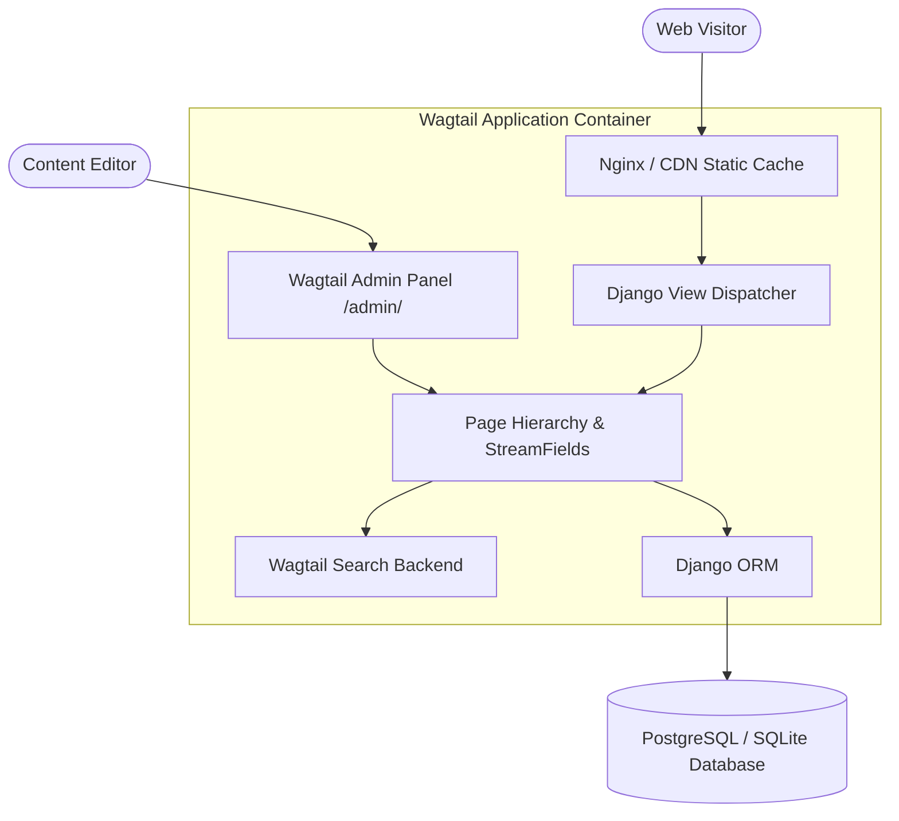

# 🌊 Wagtailwind: Enterprise Wagtail CMS with Tailwind CSS

> An enterprise-grade Content Management System leveraging **Wagtail CMS** and **Django**, styled with a custom **Tailwind CSS** utility-first design system and containerized with Docker.

[](https://python.org)
[](https://djangoproject.com)
[](https://wagtail.org)
[](https://tailwindcss.com)
[](https://docker.com)
[](../../LICENSE)

---

## 🌟 Key Capabilities

1. **Modern Editorial Workflow**: Intuitive Wagtail admin interface with live previews, draft revisions, streamfields, and scheduled publishing.
2. **Tailwind CSS Integration**: Fully customized Tailwind theme providing cohesive utility styling, responsive typography, and dark mode support.
3. **Optimized Asset Pipeline**: Automated Tailwind CSS compilation generating purged, production-ready stylesheets with minimal payload size.
4. **Fast Full-Text Search**: Native Wagtail search backend supporting indexed model fields and query relevance scoring.
5. **Containerized Deployment**: Multi-stage Dockerfile optimized for production WSGI serving with Gunicorn and static caching.

---

## 🏗️ System Architecture



---

## 📂 Project Directory Structure

```text
apps/wagtailwind/
├── home/                               # Homepage Models & Templates
│   ├── models.py                       # HomePage Page Tree Definition
│   └── templates/                      # Tailwind Styled Templates
├── search/                             # Wagtail Search Views & Queries
├── theme/                              # Tailwind CSS Source & Static Assets
│   └── static_src/                     # Tailwind Config & CSS Input
├── wagtailwind/                        # Project Core Settings & URLs
│   ├── settings/                       # Base, Dev, and Prod Settings
│   ├── urls.py                         # Route Dispatcher
│   └── wsgi.py                         # Production Entrypoint
├── Dockerfile                          # Containerized Production Build
├── manage.py                           # Django CLI Utility
└── requirements.txt                    # Python Dependencies
```

---

## 🚀 Quick Start (Local Setup)

### 1. Prerequisites
- Python 3.9+
- Node.js 18+ (for Tailwind asset compilation)

### 2. Install & Run:
```bash
cd apps/wagtailwind

# Create and activate virtual environment
python3 -m venv venv
source venv/bin/activate

# Install Python packages
pip install -r requirements.txt

# Run migrations
python manage.py migrate

# Create superuser for Wagtail Admin
python manage.py createsuperuser

# Start development server
python manage.py runserver 0.0.0.0:8000
```

* **Public Website**: [http://localhost:8000](http://localhost:8000)
* **Wagtail CMS Admin**: [http://localhost:8000/admin/](http://localhost:8000/admin/)

---

## 🐳 Docker Deployment

```bash
cd apps/wagtailwind
docker build -t wagtailwind:latest .
docker run -p 8000:8000 wagtailwind:latest
```

---

## 👤 Author & Monorepo
* **Engineer**: Abhijeet Raut ([@arauthub](https://github.com/arauthub))
* **Repository**: [`All-Projects/apps/wagtailwind`](https://github.com/arauthub/All-Projects/tree/main/apps/wagtailwind)