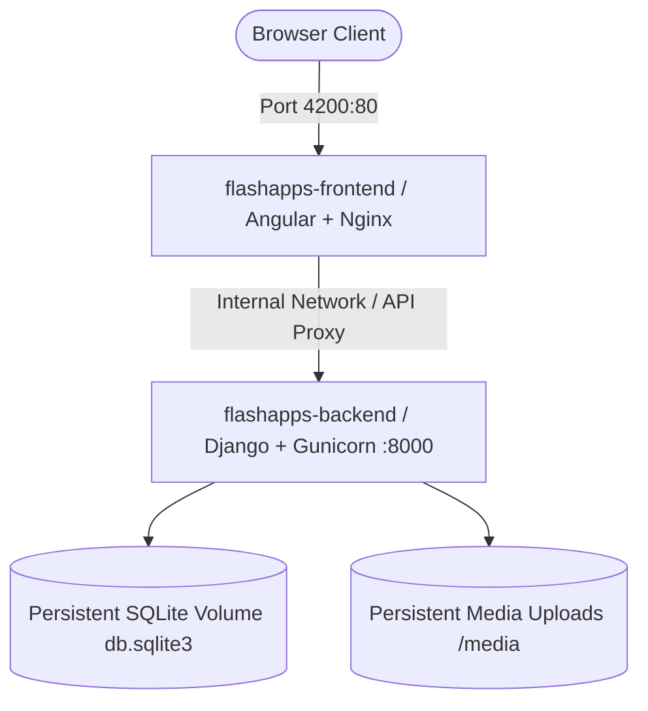

# 🐳 DevOps: Multi-Container Docker Orchestration

> Unified **Docker Compose** multi-service orchestration pairing backend REST microservices, reactive frontend single-page applications, and persistent volumes.

[](https://docker.com)
[](https://docs.docker.com/compose/)
[](https://nginx.org)
[](../../LICENSE)

---

## 🏗️ Orchestration Topology



### Services Defined in `compose.yaml`:
1. **`flashapps-backend`**:
   - Builds from `../../apps/flashapps/backend`.
   - Exposes port `8000`.
   - Volume mounts local database (`db.sqlite3`) and user media uploads (`media/`) for persistent state retention.
   - Sets environment to `DJANGO_SETTINGS_MODULE=flashapps_backend.settings.dev`.
2. **`flashapps-frontend`**:
   - Builds from `../../apps/flashapps/frontend`.
   - Exposes port `4200`.
   - Sets dependency on `backend` service health.

---

## 🚀 Usage & Commands

```bash
cd devops/docker

# 1. Start all containers in detached mode with fresh build
docker compose up --build -d

# 2. View streaming logs from all services
docker compose logs -f

# 3. Check status of running containers
docker compose ps

# 4. Stop and remove containers (preserving volumes)
docker compose down
```

---

## 👤 Author & Monorepo
* **Engineer**: Abhijeet Raut ([@arauthub](https://github.com/arauthub))
* **Repository**: [`All-Projects/devops/docker`](https://github.com/arauthub/All-Projects/tree/main/devops/docker)
