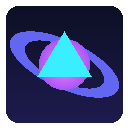

# 🌌 Anti-Gravity Web — Interactive Physics & Arcade Browser

> A Chrome Extension (Manifest V3) that transforms any active webpage into an interactive Zero-G physics playground with gamified arcade modes, non-destructive DOM extraction, and instant layout restoration.



---

## ✨ Key Features

1. **Non-Destructive DOM Extraction**:
   - Identifies visible semantic elements (`h1`-`h6`, paragraphs, cards, buttons, images, quotes).
   - Clones them into an isolated, high-performance overlay container (`#antigravity-sandbox-root`) with exact computed styles.
   - Sets original elements to `visibility: hidden`, preserving the host site's CSS grid/flex layout completely without layout collapse or script interference.

2. **Offline 2D Rigid Body Physics (Matter.js)**:
   - 100% Manifest V3 compliant with locally bundled `lib/matter.min.js` (no remote code execution).
   - Custom 60 FPS synchronization pipeline mapping Matter.js physics coordinates (`x`, `y`, `angle`) to CSS `transform: translate3d(...) rotate(...)`.
   - Tuned restitution (bounciness), air friction, and perimeter viewport boundary walls.

3. **Zero-G Drift & Invertible Directional Gravity**:
   - **Zero-G Mode**: Elements drift smoothly like space debris in microgravity.
   - **Arrow Keys Inversion**:
     - `▲ Up Arrow`: Gravity reverses upward.
     - `▼ Down Arrow`: Gravity pulls downward.
     - `◄ Left Arrow`: Gravity pulls left.
     - `► Right Arrow`: Gravity pulls right.
     - `0` or `Z`: Instantly toggle Zero-G.
   - Fine-tuned Gravity Strength slider in the popup (0.2x to 2.2x).

4. **Dynamic Mouse Force Tools**:
   - 🖐️ **Drag & Fling**: Pick up headings, buttons, or cards with your mouse and launch them across the viewport.
   - 🧲 **Tractor Beam**: Pull surrounding elements towards the cursor with glowing cyan energy tethers.
   - 💥 **Repulsor Pulse**: Blast nearby elements away with an explosive shockwave force.

5. **Gamification Arcade Modes**:
   - 🚀 **Asteroids Browser**:
     - Spawns a retro vector interceptor that tracks your cursor.
     - Fly using `WASD` or `Arrow Keys`.
     - Fire plasma lasers using `Spacebar` or `Left Click`.
     - Elements flash on hit, take damage, and explode into glowing sparks and letters (+100 PTS)!
   - 🟡 **Orbital Katamari**:
     - Steer a magnetic Katamari sphere using `WASD` or `Arrow Keys`.
     - Rolls across the screen, accumulating velocity and rotation.
     - Elements smaller than the Katamari get absorbed and stick to the sphere!
     - The Katamari expands in size and mass as you roll up the webpage.
   - 🌌 **Zero-G Playground**:
     - Pure physics sandbox with free bouncing, gravity inversion, and tractor beam manipulation.

6. **Interactive "How to Play" Tutorial Modal**:
   - Step-by-step animated guide explaining flight, twin laser blasting, Black Hole singularity, and multi-stage objectives.
   - Saves completion preference in local storage; easily reopen anytime via `❓ Guide` button.

7. **5-Stage Multi-Wave Progression (Easy to Nightmare)**:
   - **Stage 1: Cadet Orbit (Easy)**: Relaxed zero-G target practice with twin rapid-fire lasers.
   - **Stage 2: Debris Splitters (Normal)**: Elements split into 2 smaller tumbling text fragments on hit!
   - **Stage 3: Cosmic Storm (Hard)**: Shifting gravitational wind pulses and spiked hazard pulsars.
   - **Stage 4: Vortex Singularity (Extreme)**: Wandering mini black holes that vacuum and crush debris.
   - **Stage 5: Quantum Chaos (Nightmare)**: Chaotic ricochets and a 60s Quantum Supernova countdown.
   - Direct difficulty selector in popup (`Cadet`, `Splitter`, `Storm`, `Vortex`, `Chaos`).

8. **Flawless Reversibility & Restoration**:
   - Press **`Escape`** or click **`Restore Original Webpage`** at any time.
   - All elements smoothly glide back to their original CSS coordinates with a 650ms easing transition.
   - Restores native page visibility and scrolling without refreshing the page.

9. **Zero-Dependency Procedural Audio**:
   - Built-in sound effects using Web Audio API: 8-bit laser blasts, explosions, Katamari absorb chimes, gravity whoosh, and restoration chords (with one-click mute).

---

## 🎮 Controls & Shortcuts

| Action | Control |
| :--- | :--- |
| **Toggle Anti-Gravity** | `Alt+Shift+G` (Mac: `Cmd+Shift+G`) or Extension Icon |
| **Restore Page** | `Escape` or **Restore** button in HUD / Popup |
| **Gravity Direction** | `Arrow Keys` (Up, Down, Left, Right) |
| **Zero Gravity** | `0` or `Z` key |
| **Shoot Lasers (Asteroids)** | `Spacebar` or `Left Click` |
| **Fly Ship / Roll Katamari** | `W`, `A`, `S`, `D` or `Arrow Keys` |
| **Drag & Throw** | Left click + drag any floating element |
| **Toggle Audio** | Click 🔊 in HUD or Popup |

---

## 🛠️ Installation (Developer Mode)

1. Clone or download this repository.
2. Open Google Chrome (or any Chromium browser like Brave, Edge).
3. Navigate to:
   ```
   chrome://extensions
   ```
4. Toggle on **Developer mode** in the top-right corner.
5. Click **Load unpacked**.
6. Select the folder:
   ```
   extensions/anti-gravity-browser
   ```
7. Open any webpage (e.g. Wikipedia, GitHub, news article, or the included `test-page/index.html`) and click the extension icon to launch Anti-Gravity!

---

## 🧪 Testing Locally

You can test the extension with the included demo page:
1. Open `test-page/index.html` in your browser.
2. Activate the extension from the browser toolbar or popup.
3. Enjoy floating the hero banner, blasting cards in Asteroids mode, or rolling up buttons in Katamari mode!

---

## 📁 Project Structure

```
extensions/anti-gravity-browser/
├── manifest.json              # Manifest V3 configuration & permissions
├── lib/
│   └── matter.min.js          # Locally bundled Matter.js 2D physics engine
├── content/
│   ├── content.js             # Core DOM cloner, physics runner & game modes
│   └── content.css            # Sandbox styling, glassmorphic HUD & VFX
├── popup/
│   ├── popup.html             # Sleek dark glassmorphic control panel
│   ├── popup.css              # Popup styling & responsive layout
│   └── popup.js               # Tab communication & state synchronization
├── background/
│   └── background.js          # Service worker for shortcut dispatch & badges
├── assets/
│   ├── icon16.png             # Extension icon (16x16)
│   ├── icon48.png             # Extension icon (48x48)
│   ├── icon128.png            # Extension icon (128x128)
│   └── generate_icons.js      # Pure Node.js PNG icon generator
└── test-page/
    └── index.html             # Interactive demo page for rapid testing
```

---

## 🔒 Security & Performance

- **No Remote Code**: Matter.js is strictly bundled locally; fully compliant with Google Chrome Web Store Manifest V3 guidelines.
- **Layout Safety**: Host DOM layout remains untouched; original elements are preserved in-place using CSS visibility rules.
- **Capped Physics Bodies**: Limited to ~50-60 high-impact semantic elements to guarantee 60 FPS performance even on heavy pages.
